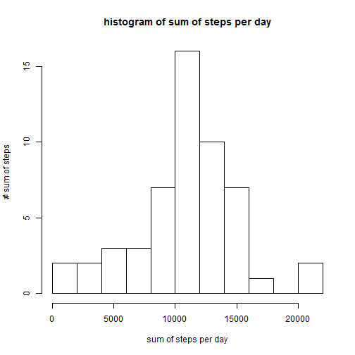
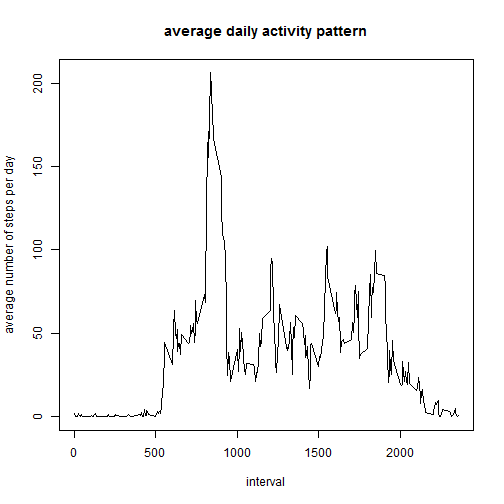
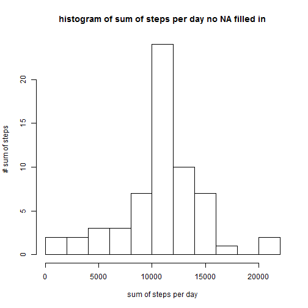
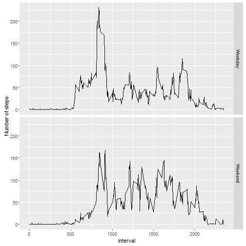

# This is a Peer Assignment 1


##first we download the file


```r
download.file("https://d396qusza40orc.cloudfront.net/repdata%2Fdata%2Factivity.zip", "repdata%2Fdata%2Factivity.zip")
```

##we unpack the file

```r
unzip("repdata%2Fdata%2Factivity.zip")
```

##load the data into f dataframe

```r
f <- read.table("activity.csv", sep=",", header=TRUE)
```

##convert date from factor to date format

```r
f$date <- as.Date(f$date, format="%Y-%m-%d")
```

##present f structure

```r
str(f)
```

```
## 'data.frame':	17568 obs. of  3 variables:
##  $ steps   : int  NA NA NA NA NA NA NA NA NA NA ...
##  $ date    : Date, format: "2012-10-01" "2012-10-01" ...
##  $ interval: int  0 5 10 15 20 25 30 35 40 45 ...
```

##present heading

```r
head(f)
```

```
##   steps       date interval
## 1    NA 2012-10-01        0
## 2    NA 2012-10-01        5
## 3    NA 2012-10-01       10
## 4    NA 2012-10-01       15
## 5    NA 2012-10-01       20
## 6    NA 2012-10-01       25
```

##prepare sum data and store in ff dataframe

```r
ff <- aggregate(f$steps, by=list(date=f$date), sum)
```

##rename names in ff

```r
names(ff) <- c("date", "sum_of_steps")
```

##plot the histogram

```r
hist(ff$sum_of_steps, breaks=15, xlab="sum of steps per day", ylab = "# sum of steps", main = "histogram of sum of steps per day")
```



##calculate and report mean (ff_mean) and median (ff_median) of total no of steps per day, respectively

```r
ff_mean <- mean(ff$sum_of_steps, na.rm =TRUE)
ff_median <- median(ff$sum_of_steps, na.rm =TRUE)
ff_mean
```

```
## [1] 10766.19
```

```r
ff_median
```

```
## [1] 10765
```

##prepare average data and store in ff_avg

```r
ff_avg <- aggregate(f$steps, by=list(date=f$interval), mean, na.rm=TRUE)
```

##rename names in ff_avg

```r
names(ff_avg) <- c("interval", "mean_of_steps_per_day")
```

##plot average daily activity pattern

```r
plot(ff_avg$mean_of_steps_per_day ~ ff_avg$interval, type="l", xlab="interval", ylab = "average number of steps per day", main="average daily activity pattern")
```



##max number of steps for above activity

```r
mm <- max(ff_avg$mean_of_steps_per_day)
ff_avg[ff_avg$mean_of_steps_per_day == mm, 1]
```

```
## [1] 835
```

##report total number of NA values

```r
colSums(is.na(f))
```

```
##    steps     date interval 
##     2304        0        0
```

##copy the main dataset to the one with no NA to be processed

```r
f_noNA <- f
```

##replace NA with mean of the interval

```r
f_noNA[is.na(f_noNA$steps),1] <- ff_avg[,2]
```

##prepare sum data of no NA dataset and store in ff_noNA

```r
ff_noNA <- aggregate(f_noNA$steps, by=list(date=f_noNA$date), sum)
```

##rename names in ff_noNA

```r
names(ff_noNA) <- c("date", "sum_of_steps")
```

##plot the histogram again with no NA values

```r
hist(ff_noNA$sum_of_steps, breaks=15, xlab="sum of steps per day", ylab = "# sum of steps", main = "histogram of sum of steps per day no NA filled in")
```



##The values differ from the estimates from the first part of the assignment. The impact of imputing missing data on the estimates of the total daily number of steps is that the values are higher than previously.

##calculate and report mean (ff_noNA_mean) and median (ff_noNA_median) of total no of steps per day

```r
ff_noNA_mean <- mean(ff_noNA$sum_of_steps, na.rm =TRUE)
ff_noNA_median <- median(ff_noNA$sum_of_steps, na.rm =TRUE)
ff_noNA_mean
```

```
## [1] 10766.19
```

```r
ff_noNA_median
```

```
## [1] 10766.19
```

##calculate weekdays

```r
f_noNA$weekday <- weekdays(f_noNA$date)
f_noNA$weekday <- ifelse(f_noNA$weekday == "Saturday" | f_noNA$weekday == "Sunday", "Weekend", "Weekday")
f_noNA$weekday <- factor(f_noNA$weekday)
```

##prepare average data for no NA dataset and store in ff_noNA_avg

```r
ff_noNA_avg <- aggregate(f_noNA$steps, by=list(date=f_noNA$interval, weekday = f_noNA$weekday), mean, na.rm=TRUE)
```

##rename names in ff_noNA_avg

```r
names(ff_noNA_avg) <- c("interval", "weekday", "mean_of_steps_per_day")
```

##plotting the time series plot

```r
library(lattice)
xyplot(mean_of_steps_per_day ~ interval | weekday, ff_noNA_avg, type = "l", layout = c(1, 2), xlab = "Interval", ylab = "Number of steps", main="panel plot containing time series across weekdays and weekends")
```


